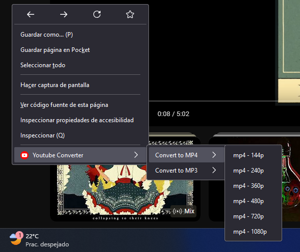

# Youtube video converter

## Table of Contents

- [About](#about)
- [Prerequisites](#Prerequisites)
- [Usage](#usage)

## About <a name = "about"></a>

A simple firefox extension that can download videos and audios of youtube videos in formats mp3 and mp4

### Prerequisites <a name = "Prerequisites"></a>

this extension requires a simple backend that i made before so you need to install it [Click Here](https://github.com/TheGod7/youtube-to-mp3-or-mp4)

### Installing

first clone the repository with this command:

```bash
git clone https://github.com/TheGod7/youtube-firefox-extension.git
```

then go to a firefox search bar and put this


then got to the section called this firefox and click in the button called load temporary addon then select the manifest file and its is all

## Usage <a name = "usage"></a>

you can use it when you are in a video url doing right click an select the option called youtube converted like this

only wait some seconds and you video will be downloaded
